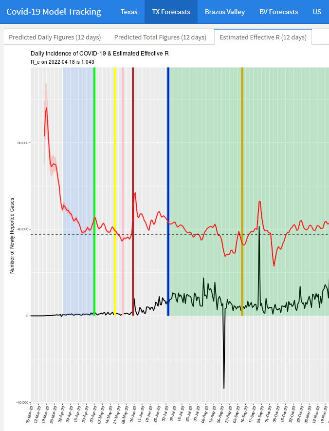
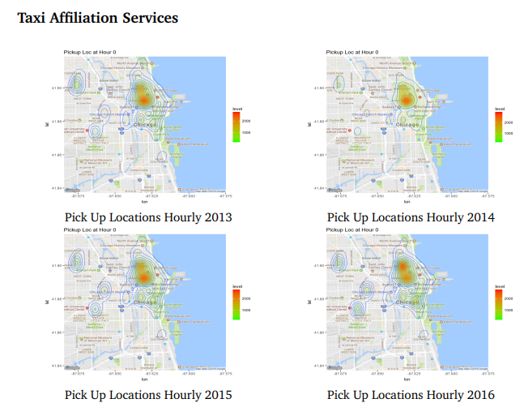
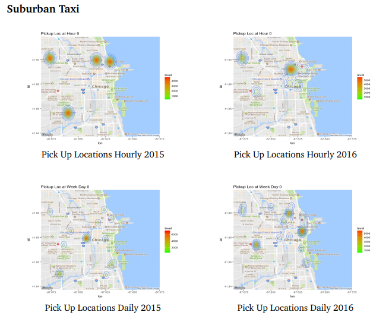
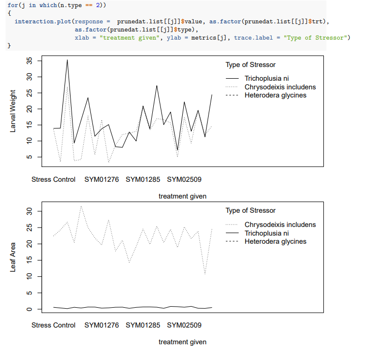

# Dashboards

We made a dashboard available for showing real-time predictions for [COVID-19 incidence rates](https://covid19-modeltrac.shinyapps.io/TX-BV-ModelTrac/). The data source no longer gives incidence rate data, so the updates themselves have not been updated, but there are still visualizations available for what it looked like in the past. 

Here's an example of it in use to look at the R0 rate.

# GitHub Repo for CVBF

A R package is available to make it easily possible to compute CVBFs for your own data. The github repository, as well as instructions on how to download it, can be found [here](https://github.com/naveedmerchant/BayesScreening).

# Report on Taxi-Cab transactions in Chicago 

The report is a group submission that looks to examine taxi-cab transaction data in Chicago. We looked at strategies employed by different companies, behaviors of taxi on different days, and more. Some images produced by the report are below.

The full report can be seen [here](https://drive.google.com/file/d/15khGImJMCg39mtY4rD0FICWweMz07zx7/view?usp=share_link). It's best to have it opened in Adobe Acrobat to view the embedded videos.

# Report on treatment effect of different fungicides

This is a report we curated while doing work under for the consulting center. The goal was to find out which fungal treatment holistcally did the best when there were many metrics to evaluate their performance AND their performance differs based on the stressor they were affected by. The plot below illustrates:

A full copy of the report can be found [here](https://github.com/naveedmerchant/naveedmerchant.github.io/blob/master/EndophytesReportFinal.pdf).
